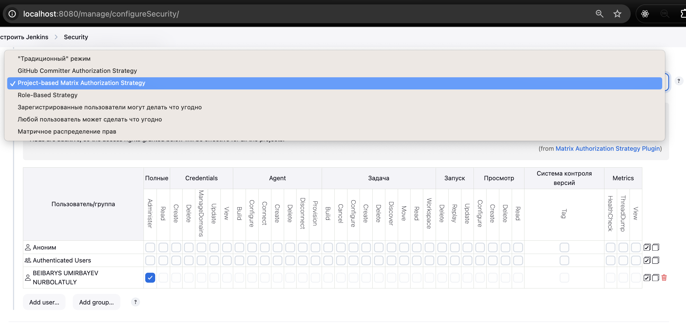

# Lesson 27-28 Jenkins Administration

## Введение

The upcoming lesson covers the following key topics:

1. **Jenkins + CLI**  
   Learn how to interact with Jenkins using the Command Line Interface for automation and configuration.

2. **Jenkins + Docker**  
   Explore integrating Jenkins with Docker for building, testing, and deploying containerized applications.

3. **Permissions**  
   Understand how to manage user roles and permissions in Jenkins to ensure secure and controlled access.

## Jenkins CLI

Jenkins has a built-in command line interface that allows users and administrators to access Jenkins from a script or shell environment (
_Source_ - [Official Jenkins CLI Documenation](https://www.jenkins.io/doc/book/managing/cli/))

- Starting point  
  http://localhost:8080/manage/cli/
- Download jenkins-cli.jar  
  `- java -jar jenkins-cli.jar -s http://localhost:8080/ help`
  Run the example from the Jenkins CLI page
- Create the JENKINS_URL environment variable
  `export JENKINS_URL=http://localhost:8080/ `
- Create an API token to authenticate with
  `http://localhost:8080/user/admin/security/ `
- Create the JENKINS_USER_ID and JENKINS_API_TOKEN environment variables
  - `  export JENKINS_USER_ID=admin`
  - `export $JENKINS_API_TOKEN=token  `
- Run the help command
  - `java -jar jenkins-cli.jar -s help`
- Run the who-am-i command
  - `java -jar jenkins-cli.jar -s who-am-i `
- Run the build command
  ` java -jar jenkins-cli.jar -s build`

---

Обратите внимание на название пользователя администратора

`java -jar jenkins-cli.jar -s http://localhost:8080/ -auth admin:password`

```shell
java -jar jenkins-cli.jar -s http://localhost:8080/ -auth Hubby:12345678

# Docker is not connected
io.jenkins.cli.shaded.jakarta.websocket.DeploymentException: Connection failed.
 at io.jenkins.cli.shaded.org.glassfish.tyrus.client.exception.Exceptions.deploymentException(Exceptions.java:40)
 at io.jenkins.cli.shaded.org.glassfish.tyrus.container.jdk.client.JdkClientContainer$1.call(JdkClientContainer.java:188)
...
```

Успешный запуск CLI

```shell
java -jar jenkins-cli.jar -s http://localhost:8080/ -auth Hubby:12345678

# Успешный запуск CLI
  add-job-to-view
    Adds jobs to view.
  build
    Builds a job, and optionally waits until its completion.
  cancel-quiet-down
    Cancel the effect of the "quiet-down" command.
  clear-queue
    Clears the build queue.
  connect-node
 update-node
    Updates the node definition XML from stdin. The opposite of the get-node command.
  update-view
    Updates the view definition XML from stdin. The opposite of the get-view command.
  version
    Outputs the current version.
  wait-node-offline
    Wait for a node to become offline.
  wait-node-online
    Wait for a node to become online.
  who-am-i
    Reports your credential and permissions.
...
```

Список команд, которые мы запустили внутри нашей CLI.

```shell
# запускаем job под название `dookie-build`
java -jar jenkins-cli.jar -s http://localhost:8080/ -auth Hubby:12345678 build dookie-build


# банальный help
java -jar jenkins-cli.jar -s http://localhost:8080/ -auth Hubby:12345678 build -help

# выводим список всех job
java -jar jenkins-cli.jar -s http://localhost:8080/ -auth Hubby:12345678 list-jobs

# удаляем job под название `dookie-build`
java -jar jenkins-cli.jar -s http://localhost:8080/ -auth Hubby:12345678 delete-job dookie-build

# проверяем список job под название `dookie-build`
java -jar jenkins-cli.jar -s http://localhost:8080/ -auth Hubby:12345678 list-jobs
```

## Jenkins Docker

Несмотря на наличие Docker у нас на локальной машине, часто требуется установка дополнительного софта.

Пример с Docker, показывает что на Jenkins можно ставить любой software.

Порядок действий такой:

1. проверить docker ps
2. зайди под root пользователем и проверить наличие docker. Если нету, то нужно поставить. Бывает что первый раз, необходимо поставить apt, docker.io и все подряд.
   `docker exec -it -u root 0eb4f8004747 bash`

`0eb4f8004747` - это id вашего контейнера. 3. Работа внутри root пользователя `root@id`

```bash
docker run nginx # будет ошибка command not found
apt update
apt install docker
apt install docker.io
docker --version # сверимся с докером будет ошибка /var/run/docker.sock
exit
```

4. Создаем docker-compose.yml и прописываем ниже детали

```yml
services:
  jenkins:
    image: jenkins/jenkins
    volumes:
      - /var/run/docker.sock:/var/run/docker.sock
    ports:
      - 8082:8080
```

и запускаем `docker compose up -d` 5.

Далее чекаем `docker ps` и очередной раз убеждаемся что у нас есть образ.
Это позволит нам запускать любые образы Frontend, Backend, приложений и т.п.

Для чего это нужно?

- Позволяет Jenkins управлять контейнерами Docker и запускать конвейеры, требующие Docker (например, сборку образов).

### Service Definition

- A Docker service named `jenkins` runs the `jenkins/jenkins `image.
- Volumes: The host's Docker socket `(/var/run/docker.sock)` is mounted into the Jenkins container, giving Jenkins access to the host's Docker daemon. This allows Jenkins to manage Docker containers directly, such as building, running, and stopping them.
- Ports: The Jenkins web interface is exposed on port `8082` (host) mapped to `8080` (container).

## Углубленная инфомрмация

### `GitLab` Docker-in-Docker (`DinD`)

Docker-in-Docker означает запуск `Docker` внутри контейнера. `GitLab CI` использует `DinD`, чтобы позволить контейнерам управлять собственными экземплярами `Docker`, обычно для задач CI/CD, таких как сборка и развертывание контейнеров.

Обе установки позволяют системам CI/CD (`Jenkins` или `GitLab`) взаимодействовать с `Docker` для таких задач, как создание образов или управление контейнерами. В то время как `Jenkins` напрямую обращается к демону `Docker` хоста через сокет, `GitLab` DinD может использовать изолированный демон `Docker` внутри контейнера.

Ниже такой же `yaml` версия для `Gitlab`

```yml
services:
  - docker:dind
variables:
  DOCKER_TLS_CERTDIR: ""
before_script:
  - apk add --no-cache docker
  - dockerd-entrypoint.sh &
  - sleep 5
```

## Jenkins Administration and Permissions

Управление Jenkins реализуется через

- правильную настройку авторизации и аутентификации
- настройку ролей и пользователей, часто используется плагин [плагин Role-based Authorization Strategy](https://plugins.jenkins.io/role-strategy/)
- добавление [folders или папки](https://www.jenkins.io/doc/book/using/best-practices/#use-organization-folders/)

1.  Авторизация и аутентификация

- Authentication: Verifies who you are (e.g., username and token).
- Authorization: Verifies what you can do (permissions).

2. Authentication Methods (Security Realms):

- Configured under Manage Jenkins > Configure Global Security > Security Realm.


- Options:
  - Jenkins' Own User Database: Default option, stores users internally.
  - LDAP and Active Directory: Integrates with enterprise directories for authentication.
  - Unix User/Group Database: Uses OS-level user/group data.

### Виды permissions

Безопасность на основе матрицы — это табличная система, которая назначает разрешения пользователям.
Для каждого пользователя вы можете предоставить или запретить доступ к определенным действиям, таким как создание, настройка или удаление заданий.

Существует 2 типа безопасности на основе матрицы:

1. Глобальная безопасность на основе матрицы: контролирует разрешения на глобальном уровне, влияя на все задания и пользователей.
2. Безопасность на основе проекта: контролирует разрешения на уровне проекта, позволяя вам устанавливать определенные разрешения для отдельных заданий и папок.



### Ролевая политика (authorazation strategies):

- Anyone Can Do Anything: обеспечивает неограниченный доступ; подходит только для изолированных тестовых сред.
- Legacy режим: администраторы имеют полный контроль; вошедшие в систему пользователи имеют право только на чтение.
- Matrix-Based Security: рекомендуемый вариант; позволяет выполнять детальные настройки разрешений для пользователей и групп.

### Best practices

В Jenkins разрешениями можно управлять с помощью безопасности на основе матрицы для назначения определенных ролей.

1. Разработчикам обычно нужны такие разрешения, как Job/Build, Job/Read, Job/Workspace, SCM/Tag, Run/Update и Overall/Read для сборки и просмотра заданий без административного доступа.
2. Административные разрешения, такие как Overall/Administer, должны быть ограничены доверенными ролями, чтобы предотвратить случайные изменения конфигурации.
3. Для больших команд используйте папки для группировки заданий и эффективного применения разрешений на основе ролей.
