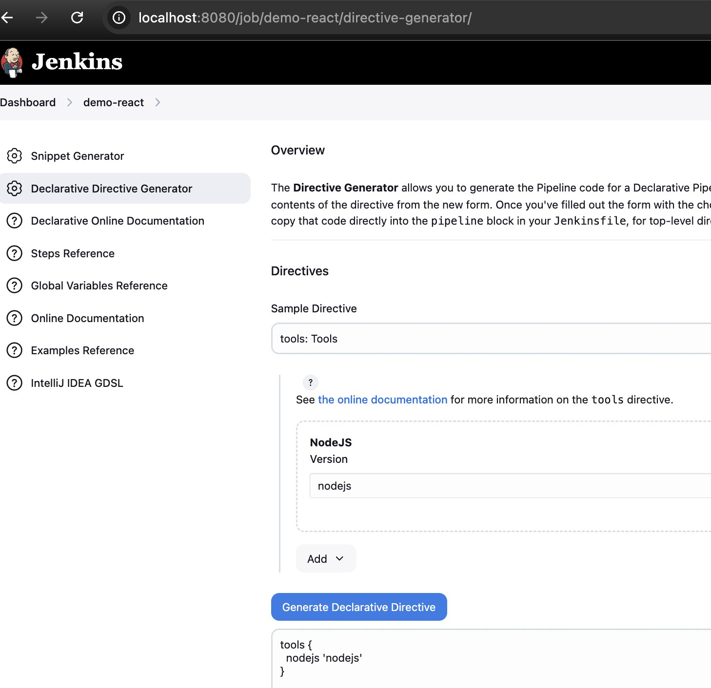
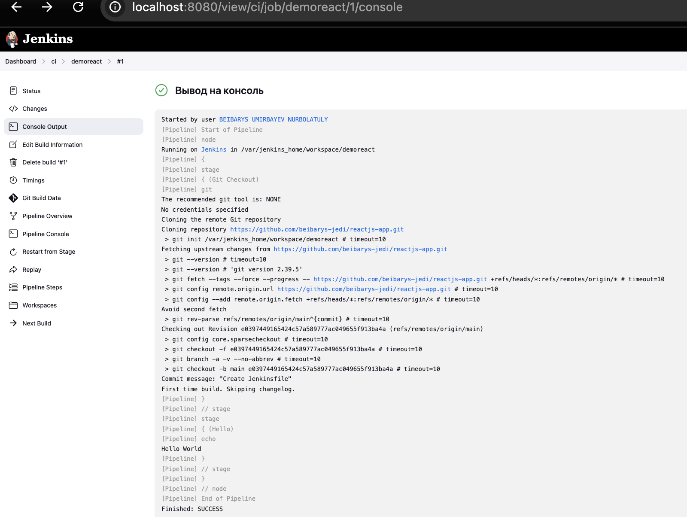
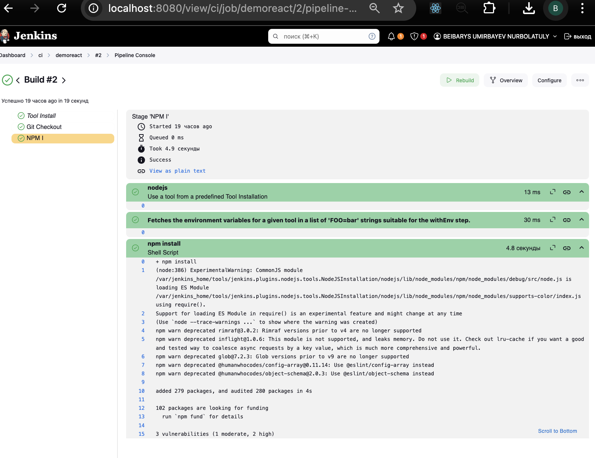
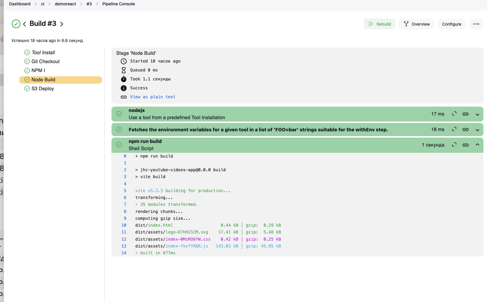
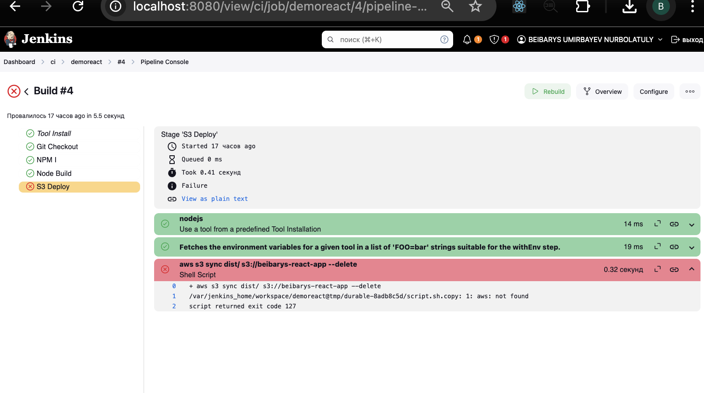
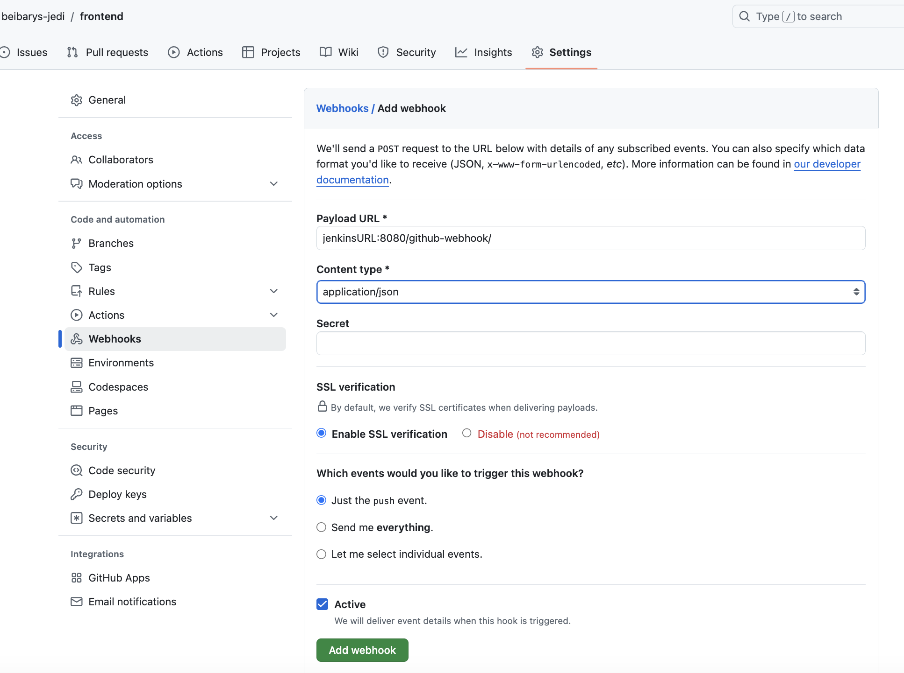
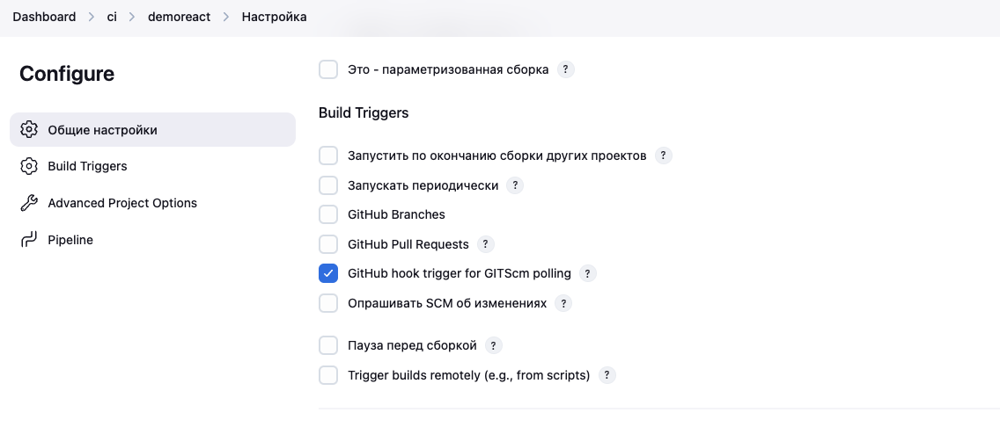

# Lesson 28 Jenkins CI Configuration

## Введение

The upcoming lesson covers the following key topics:

1. **Jenkins + GitHub**  
   Understand how to connect Jenkins with GitHub for seamless CI/CD processes

2. **Jenkins Frontend**  
   Dive into configuring and automating frontend project builds using Jenkins pipelines.

3. **Jenkins Backend**  
   Learn how to automate and manage backend development workflows with Jenkins.

## Jenkins Github

Требования - наличия Github, SSH ключей

1. Форкнуть проект https://github.com/beibarys-jedi/frontend
2. Запустить локально у себя `git clone project-url`
3. Работа с Node.js

- Установить плагин Node.js
- Откройте в Jenkins `http://localhost:8080/manage/configureTools/` и добавить установку `Jenkins`
- Запустить job pipeline и прикрепить ссылку на `Github`
- В синтаксисе добавить команду загенерированную типа ниже
  

## Exercise 1

Добавить ссылку на проект `Github` и указать `branch`

```groovy
pipeline {
    agent any

    tools {
        nodejs 'nodejs'
    }

    stages {
        stage('Git Checkout') {
            steps {
                git url: "https://github.com/beibarys-jedi/reactjs-app.git", branch: "main"
            }
        }
    }
}
```

## Jenkins Frontend

## Exercise 2

Добавить `npm install` в новый stage.

```groovy
pipeline {
    agent any

    tools {
        nodejs 'nodejs'
    }

    stages {
        stage('Git Checkout') {
            steps {
                git url: "https://github.com/beibarys-jedi/reactjs-app.git", branch: "main"
            }
        }
        // solution below
        stage('NPM I') {
            steps {
                sh "npm install"
            }
        }
    }
}
```

## Exercise 3

Добавить stage для сборки проекта

```groovy
pipeline {
    agent any

    tools {
        nodejs 'nodejs'
    }

    stages {
        stage('Git Checkout') {
            steps {
                git url: "https://github.com/beibarys-jedi/reactjs-app.git", branch: "main"
            }
        }
        stage('NPM I') {
            steps {
                sh "npm install"
            }
        }
        // solution below
        stage('Node Build') {
            steps {
                sh "npm run build"
            }
        }
    }
}
```

## Exercise 4

Добавить stage для доставки кода на AWS S3

```groovy
pipeline {
    agent any

    tools {
        nodejs 'nodejs'
    }

    stages {
        stage('Git Checkout') {
            steps {
                git url: "https://github.com/beibarys-jedi/reactjs-app.git", branch: "main"
            }
        }
        stage('NPM I') {
            steps {
                sh "npm install"
            }
        }
        stage('Node Build') {
            steps {
                sh "npm run build"
            }
        }

        // solution below
        stage('S3 Deploy') {
            steps {
                // move file to S3 Bucket
                sh "aws s3 sync dist/ s3://beibarys-react-app --delete "
            }
        }
    }
}
```

## Решения

1.  Exercise 1



2.  Exercise 2



3.  Exercise 3



4.  Exercise 4



## Углубленная инфомрмация - Credentials

Если у вас репозиторий будет приватный, то нужно добавить флаг `credentialsId: "credentials"`
Сами креды, можно получить внутри репы.
Задание Jenkins можно запустить вручную (или) автоматически.

## Углубленная инфомрмация - Webhook

1. Github Webhook

### Настройка Webhook

Всякий раз, когда разработчик фиксирует код, это изменение будет автоматически применено на сервере.

Для этого мы используем WebHooks и ниже скрин добавить вебхуки из gitHub

1. Откройте репозиторий → настройки → вебхуки → Добавить вебхук



2. Теперь нам нужно активировать в панели управления jenkins, здесь Перейдите в Job → Настроить → выберите нижеприведенную опцию → сохранить



## Углубленная инфомрмация - Backend

Процесс описывает установку бэкенда с использованием FastAPI, вероятно, в установке Jenkins.
! Обязательно нужно зайти под `root` user.

Установка включает:

1. Настройка Python и Pip:

- Установите Python 3 и Pip (например, `apt install python3` и `apt install pip3`).
- Решите проблемы с управлением пакетами (например, удалите `/usr/lib/python3.*/EXTERNALLY-MANAGED`).

2. Установка FastAPI и инструментов тестирования:

- Используйте Pip для установки FastAPI (`pip install fastapi`) и инструментов тестирования, таких как Pytest (`pip install pytest`).

3. Настройка Docker:

- Установите Docker (`apt install docker` или `apt install docker.io`) и проверьте, запустив тестовый контейнер (`docker run nginx`) если не поставлено.

Это гарантирует подготовку бэкенд-среды с FastAPI, включая зависимости Python и Docker для контейнерных развертываний.

! Тестовый проект Смагул-агая - `https://github.com/Smagicom/fastapitest`
